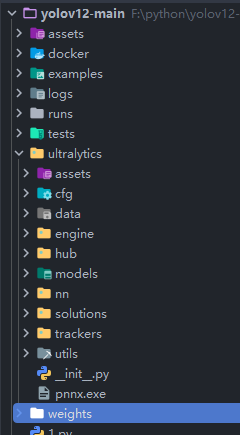

# ncnn-yolov13-android
Yolov13 model supports android deployment. Yolov8, Yolov11 and Yolov12 can be supported.

## Please, have some stars for this repo. Thank you! 🌟🌟🌟🌟🌟

## Support the latest pnnx export

Download the latest pnnx and put it in the `ultralytics` directory.



```python
# -*- coding: UTF-8 -*-
"""
  @Author: mpj
  @Date  : 2025/2/20 18:44
  @version V1.0
"""
from ultralytics import YOLO

if __name__ == '__main__':
    model = YOLO("./weights/yolov13n.pt")
    model.export(**{
        'format': 'ncnn',
        'opset': 12,
        'simplify': True,
        'batch': 1,
        'imgsz': 320,  # This size should be consistent with the following code.
    })

```

file [
`native-lib.cpp`](https://github.com/mpj1234/ncnn-yolov13-android/blob/133956d0ab0a027d4ff3519c4f234e3f77e4406b/app/src/main/cpp/native-lib.cpp#L170)

``` c++
const int target_sizes[] =
{
    320,
    320,
};
```

## Visualization result

<table>
  <tr>
    <td></td>
    <td></td>
  </tr>
</table>

## Bug
